# Accediendo a Linux en AWS

Para poder crear un _**node**_ (nodo) desde el _**source code**_ (código fuente), ejecutarlo y conectarlo a la _**mainnet**_ (red principal), necesitás un sistema operativo Linux, al menos 4GB de memoria RAM y 24GB libres en el disco duro. La memoria RAM es más que nada necesaria para _crear_ el nodo; para _ejecutarlo_, 1GB será más que suficiente. El espacio en el disco duro es necesario si querés conectarte a y descargar la _**blockchain**_ (cadena de bloques) de Cardano en su _mainnet_. Si vos solo querés preparar una testnet (red de prueba) local o conectarte a una _testnet_ externa, vas a necesitar menos de 24GB.

Si no tenés acceso a una computadora que use Linux, podés usar **Amazon Web Services (AWS)** para crear una máquina virtual localizada en la nube (**cloud**) que contenga Linux como su sistema operativo. Para hacer eso, seguí los siguientes pasos:

1. Andá a [Amazon Web Services (AWS)](https://aws.amazon.com/) y creá una cuenta (gratis) si no tenés una.

2. Go to the _AWS Management Console_.

3. Go to the _EC2 Dashboard_.

   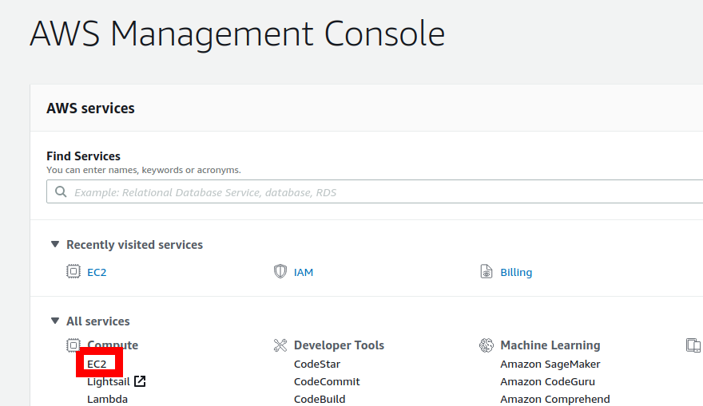

4. If you already have a running instance, go to step 9.

5. We first make sure to get enough harddrive space (at least 24GB). Click on _Volumes_.

   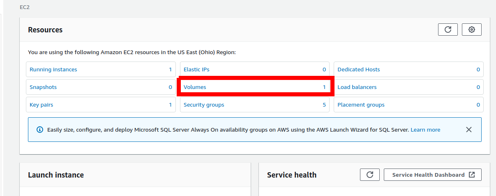

6. Under _Actions_, select _Modify Volume_.

   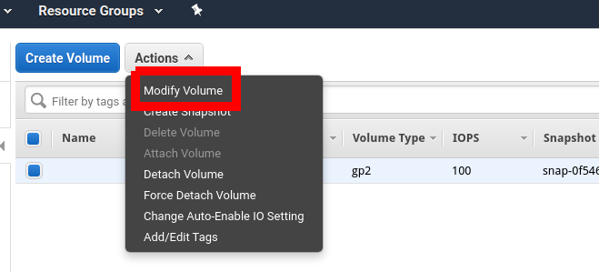

7. In the _Modify Volume_ diaglog, select a size of 24 and click _Modify_, then confirm in the next dialog.

   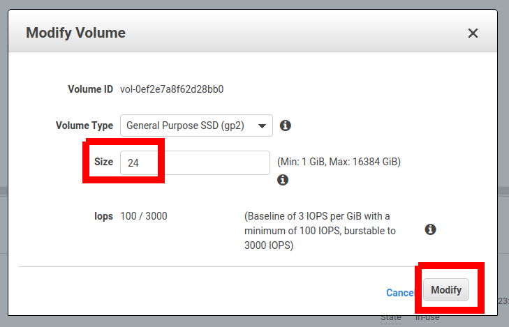

8. Go back to the _EC2 Dashboard_.

   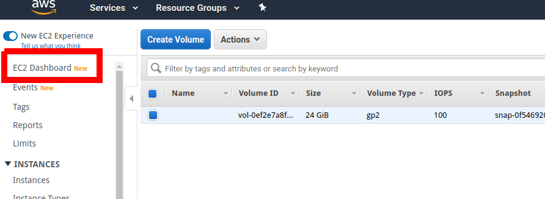 

9. Go to _Launch Instance_.

  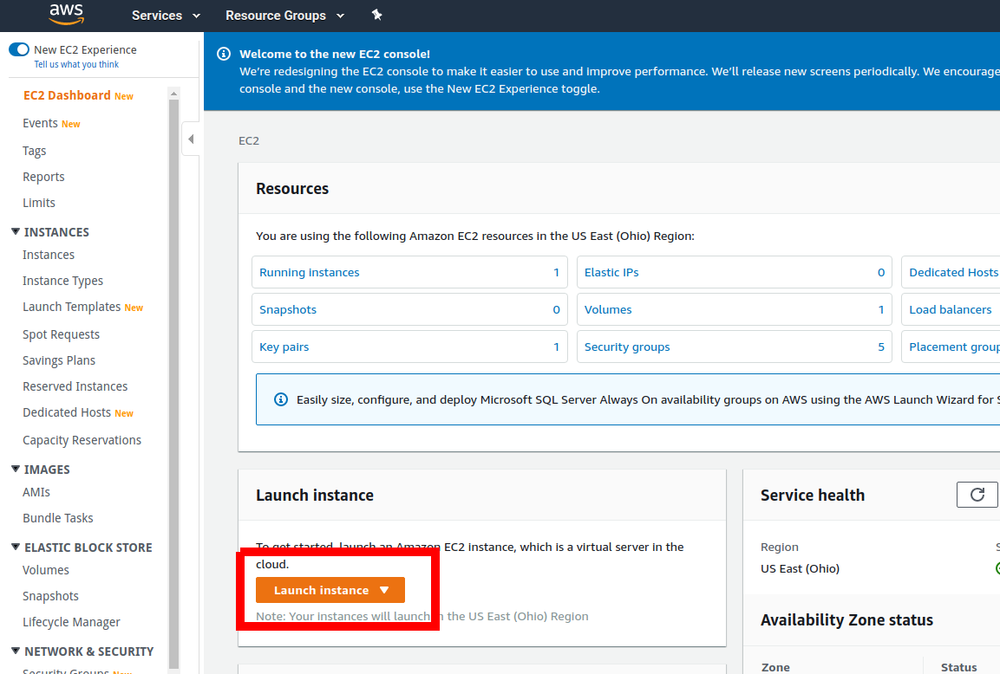

10. As Amazon Machine Image, choose _Amazon Linux 2 (HVM), SSD Volume Type_, 64-bit (x86).

  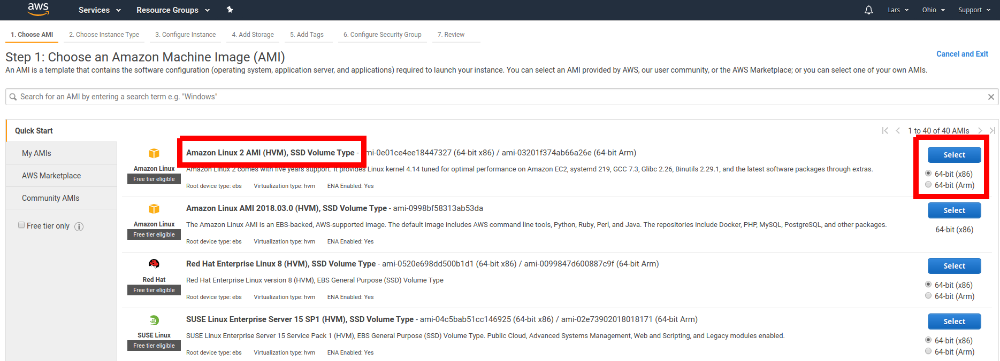

11. As Instance Type, choose _t2.medium_, then click _Review and Launch_ and finally _Launch_ on the next screen.

  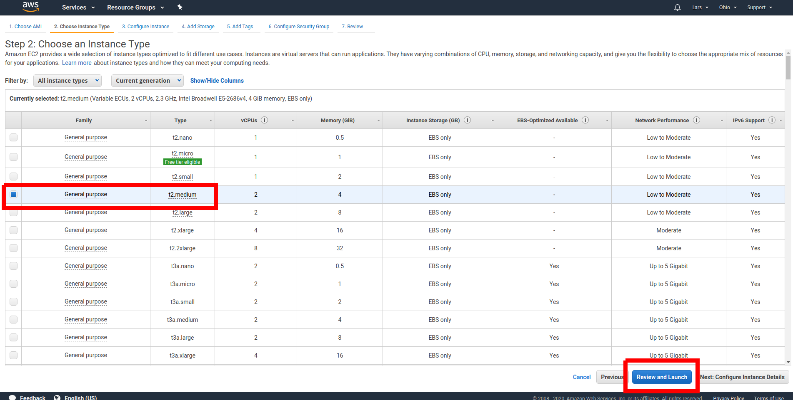

12. Create a key pair (or use an existing one).

  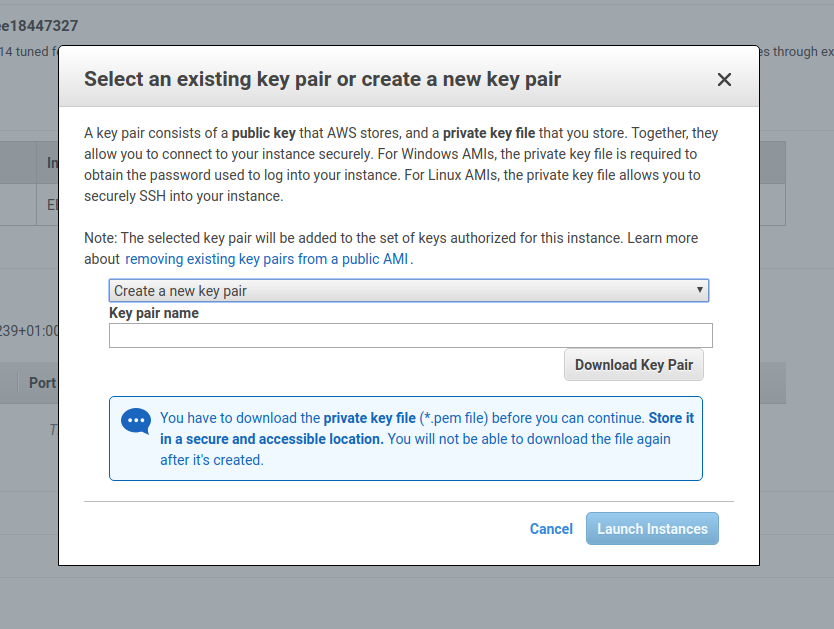

13. _Connect_ to your instance.

  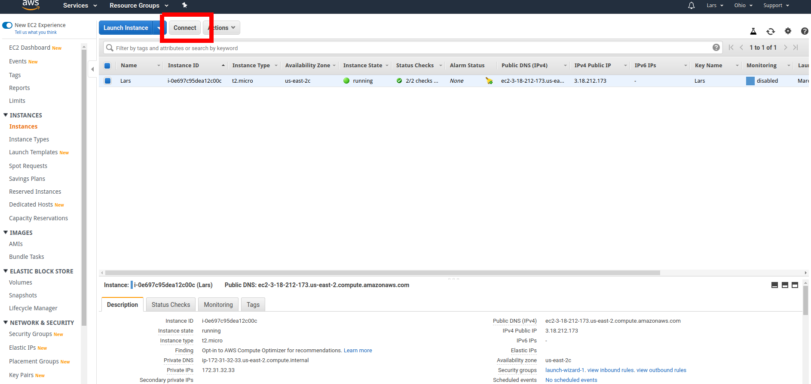

14. You can use the _EC2 Instance Connect_ connection method.

  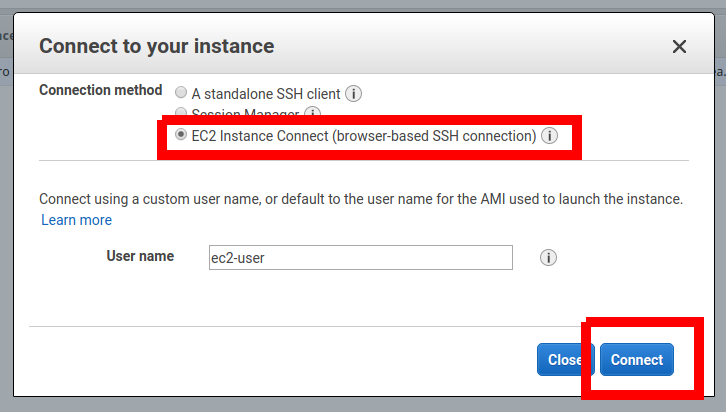

15. Type ``echo hello`` (and Enter) to try whether the connection works. This should print "hello" to the console.

  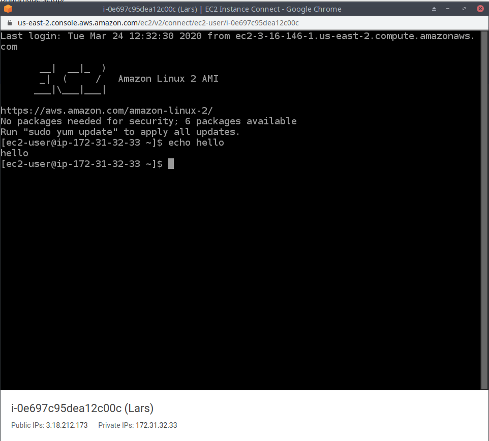

Congratulations! You have now access to a machine running Linux.
