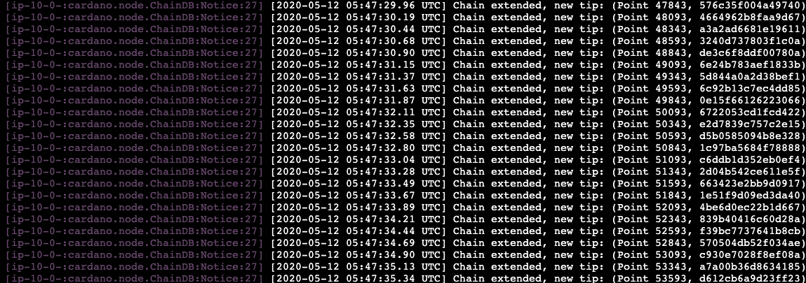

# Instalando y Ejecutando un Nodo

ACTUALIZADO PARA EL _TAG_: 1.14.2

## PRERREQUISITOS

Prepará tu plataforma:

Vas a necesitar:

* Un x86 _**host**_ (huésped) (AMD or Intel), _**Virtual Machine (VM)**_ (máquina virtual) o una instancia con _**AWS**_ con al menos 2 _**cores**_ (núcleos), 4GB de memoria RAM y al menos 10GB de espacio libre de disco duro;
* Una versión reciente de Linux, no Windows ni MacOS – esto nos ayudará a aislar cualquier problema que pueda presentarse;
* Asegurate que estés en una red que no tenga su _**firewall**_ activa. En especial, vamos a usar los puertos 3000 y 3001 TCP/IP por default para establecer conexiones con los otros nodos, así que estos puertos deberían de estar abiertos.
* Puedes seguir este [TUTORIAL DEL SERVIDOR](000_AWS.md) para tener el servidor funcionando.

## Instalar _**dependencies**_ (dependencias)

Necesitamos los siguientes paquetes y herramientas en nuestro Sistema Linux para descargar el código fuente and crearlo:
    - la versión del sistema de control ``git``,
    - el ``gcc`` C-compiler,
    - el soporte C++ para ``gcc``,
    - librerías de desarrollador para la arbitrary precision library ``gmp``,
    - librerías de desarrollador para compression library ``zlib``,
    - librerías de desarrollador para ``systemd``,
    - librerías de desarrollador para ``ncurses``,
    - ``ncurses`` librerías de compatibilidad,
    - la herramienta de creación de Haskell, ``cabal``,
    - el compilador GHC de Haskell.

Si estamos usando una instancia AWS en Amazon Linux AMI 2 (ver el [tutorial de AWS](000_AWS.md) para preparar un ambiente con una instancia de AWS) u otro sistema basado en CentOS/RHEL, podemos descargar las dependencias de la siguiente forma:

    sudo yum update -y
    sudo yum install git gcc gcc-c++ tmux gmp-devel make tar wget zlib-devel libtool autoconf -y
    sudo yum install systemd-devel ncurses-devel ncurses-compat-libs -y

Para Debian/Ubuntu usá los siguiente:

    sudo apt-get update -y
    sudo apt-get install build-essential pkg-config libffi-dev libgmp-dev libssl-dev libtinfo-dev libsystemd-dev zlib1g-dev make g++ tmux git jq wget libncursesw5 libtool autoconf -y

Si estás usando un sabor de Linux diferente, vas a necesitar usar el administrador de paquetes apropiado para tu plataforma en vez de `yum` o `apt-get`, y los nombres de los paquetes que tenés que instalar pueden ser distintos.

Descargá, descomprimí, instalá y actualizá Cabal:

    wget https://downloads.haskell.org/~cabal/cabal-install-3.2.0.0/cabal-install-3.2.0.0-x86_64-unknown-linux.tar.xz
    tar -xf cabal-install-3.2.0.0-x86_64-unknown-linux.tar.xz
    rm cabal-install-3.2.0.0-x86_64-unknown-linux.tar.xz cabal.sig
    mkdir -p ~/.local/bin
    mv cabal ~/.local/bin/

Esto funcionará con una [instancia de AWS](000_AWS.md) y assume que la carpeta `~/.local/bin` se encuentra en tu `PATH` (ruta).
En otros sistemas, tenés que mover el ejecutable a una carpeta que esté en tu `PATH` modificar tu `PATH` agregando la línea

    export PATH="~/.local/bin:$PATH"

a tu archivo `.bashrc`.

## Añadiendo ~/.local/bin y ~/.cabal/bin al PATH

Navegá a tu carpeta principal (home):

    $ cd
Abrí tu archivo .bashrc con el editador de texto nano

    $ nano .bashrc
Andate a la última línea del archivo y añadí las siguientes líneas

    export PATH="~/.cabal/bin:$PATH"
    export PATH="~/.local/bin:$PATH"

Tenés que reiniciar tu servidor o _**source**_ tu archivo .bashrce

    source .bashrc

Actualizá cabal

    cabal update

Las instrucciones anteriores instalan Cabal versión `3.2.0.0`. Podés revisar la versión tecleando

   cabal --version

Descargá e instalá GHC:

    wget https://downloads.haskell.org/~ghc/8.6.5/ghc-8.6.5-x86_64-deb9-linux.tar.xz
    tar -xf ghc-8.6.5-x86_64-deb9-linux.tar.xz
    rm ghc-8.6.5-x86_64-deb9-linux.tar.xz
    cd ghc-8.6.5
    ./configure
    sudo make install
    cd ..

Instalá _**Libsodium**_

    git clone https://github.com/input-output-hk/libsodium
    cd libsodium
    git checkout 66f017f1
    ./autogen.sh
    ./configure
    make
    sudo make install

    export LD_LIBRARY_PATH="/usr/local/lib:$LD_LIBRARY_PATH"

## Descargar el código fuente para el cardano-node

Para descargar el código fuente, usamos el git:

    git clone https://github.com/input-output-hk/cardano-node.git

Esto creará una carpet ``cardano-node``, y descargará el código fuente más reciente del git en la nueva carpeta.

Una vez que la descarga haya terminado, podemos revisar sus contenidos usando

    ls cardano-node

¡Ojo que el contenido de tu carpeta ``cardano-node`` pueda ser un poco diferente que el nuestro!

Cambiamos el _**working directory**_ (directorio actual) a la carpeta descargada del código fuente:

    cd cardano-node

Con armados reproducibles, deberíamos de “check out” un _**"tag"**_ es específico.
Para la Shelley _Testnet_, vamos a usar el _tag_ `1.14.2`, el cual podemos check out de la siguiente forma:

    git fetch --all --tags
    git tag
    git checkout tags/1.14.2

## Crear e instalar el nodo

Ahora podemos crear e instalar el nodo con ``cabal``, el cual tardará unos minutos la primera vez que lo creés. Para los futuros armados será mucho más rápido, puesto que todo lo que no se tenga que modificar quedará en caché.

   		cabal install cardano-node cardano-cli

Esto creará e instalará `cardano-node` and `cardano-cli` en tu carpeta `~/.cabal/bin` por default, así que lo que mencionamos anteriormente sobre tu `PATH` también aplica aquí: Asegurate que la carpeta `~/.cabal/bin` se encuentre en tu _path_ o copiá los ejecutables a una carpeta que se encuentre en tu path. De manera alterna, podés ejecutar `cabal install cardano-node cardano-cli --installdir="$HOME/.local/bin"` para instalar los `cardano-node` y `cardano-cli` directamente en tu carpeta `~/.local/bin`.

**OJO**: Cuando usés **cabal install**, asegurate que tengás `overwrite-policy: always` en tu `.cabal/config` o que hayás eliminado las versiones anteriores de `cardano-node` y `cardano-cli` from `~/.cabal/bin`. De lo contrario, cabal install no eliminará los ejecutables anteriores.

Si algún día deseás actualizar el código a una versión más reciente, dirigite a tu directorio `cardano-node` directory, _**pull**_ el código más reciente con ``git`` y recreá.

Esto será mucho más rápido que la primera vez que lo creaste:

    cd cardano-node
    git fetch --all --tags
    git tag
    git checkout tags/<the-tag-you-want>
    cabal install cardano-node cardano-cli

Esto creará e instalá `cardano-node` y `cardano-cli` en tu carpeta `~/.cabal/bin`. De manera alterna, podés ejecutar `cabal install cardano-node cardano-cli --installdir="$HOME/.local/bin"` para instalar los `cardano-node` y `cardano-cli` directamente en tu carpeta `~/.local/bin`.

**OJO:** Puede que sea necesario eliminar la carpeta `db`(carpeta de base de datos) antes de ejecutar una versión actualizada del nodo.

Podemos iniciar el nodo en la Cardano _mainnet_ con

    scripts/mainnet.sh

   

¡Felicidades! Haz instalado el nodo, iniciado y conectado a la Cardano _mainnet_.
